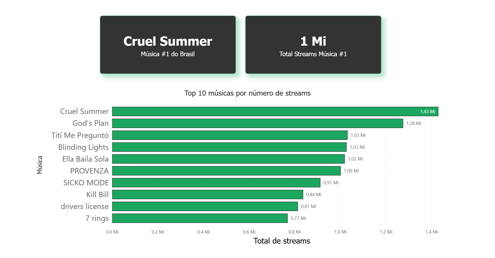
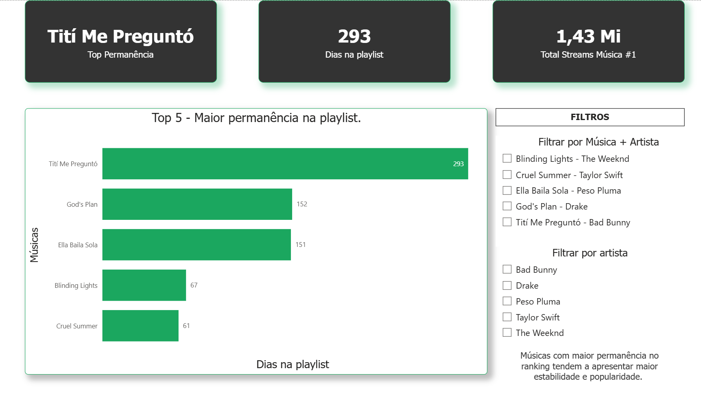
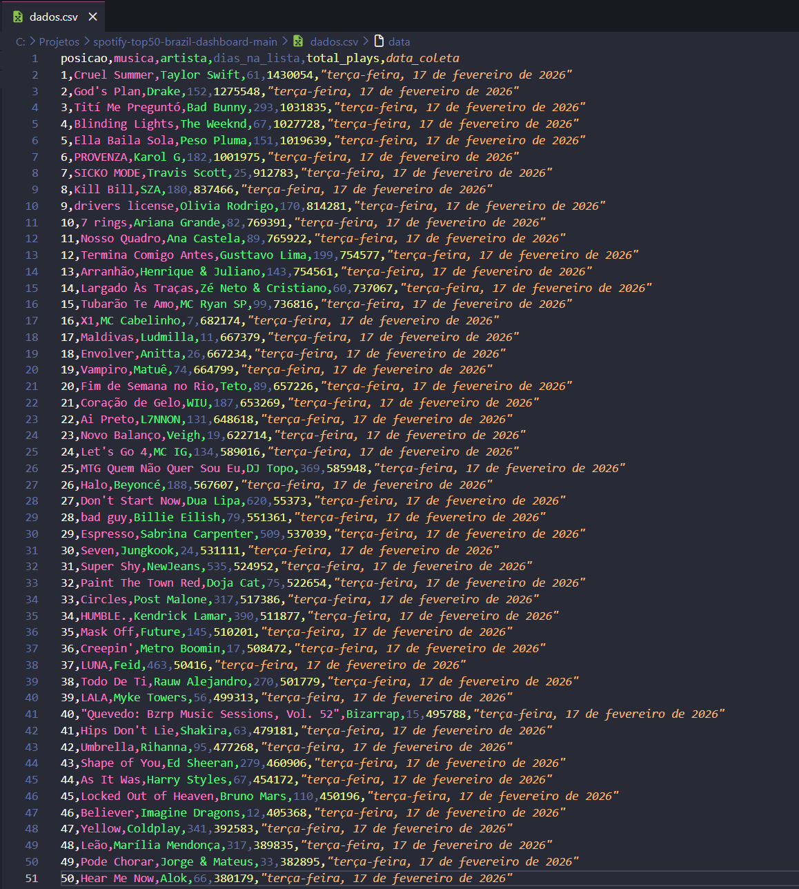

# 🎧 Spotify Top 10 Brasil - Dashboard de Análise de Dados (Power BI)

Projeto de análise de dados utilizando Power BI com foco em visualização e geração de insights a partir de dados do Spotify.

## 📌 Contexto do Projeto

Projeto da disciplina de Business Intelligence, do curso de Análise e Desenvolvimento de Sistemas.
Análise de dados utilizando Power BI para explorar o comportamento das músicas mais tocadas no Spotify Brasil, gerando insights sobre popularidade, tendência e performance de artistas.

### 📈 Principais Insights

- A distribuição de streams não é homogênea: poucas músicas concentram grande parte das reproduções.
- Músicas com maior permanência na playlist tendem a acumular mais streams.
- Existem padrões de crescimento e queda ao longo do tempo, indicando ciclos de popularidade.

---

## 📊 Dashboard

### Visão Geral

### Detalhamento

---

## 🚀 Dados Utilizados

### Dados TOP 50

---

## 🛠️ Ferramentas utilizadas

- Power BI
- Visual Studio Code (para edição de .CSV)

---

## 👩‍💻 Autoras

**Millena Joana da Rosa**  
[LinkedIn](https://www.linkedin.com/in/millenarrosa/)

**Manuela Fortes**  
[LinkedIn](https://www.linkedin.com/in/manuela-fortes/)
